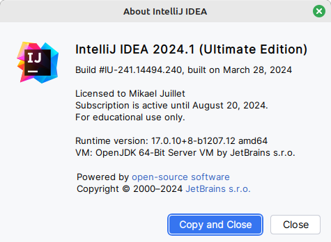
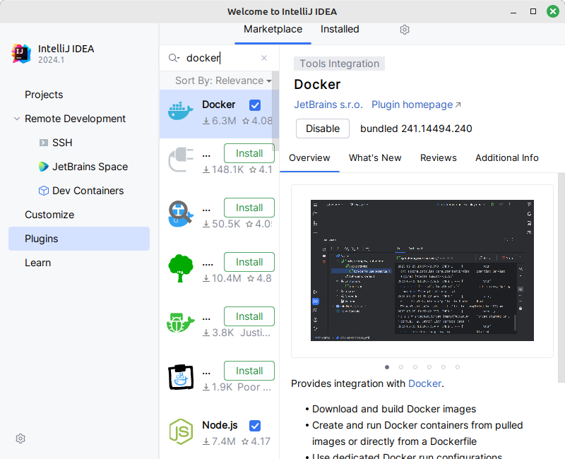

# Labo01 - Environment Setup

* [Labo description](https://cpnv-es-ngy.gitbook.io/vir1/labs/labo01-environment-setup)

## DevOps Stack to setup

Mention in this documentation the orders carried out and the results obtained.

If you have opted for a graphical installation, provide screenshots and describe the procedure up to the result obtained.

### Cloud cmd line interface - AWS Cli
[Official documentaion](https://docs.aws.amazon.com/cli/latest/userguide/getting-started-install.html#cliv2-linux-install)
To install the aws-cli/2.15.41, run the following commands.
``` bash
curl "https://awscli.amazonaws.com/awscli-exe-linux-x86_64.zip" -o "awscliv2.zip"
unzip awscliv2.zip
sudo ./aws/install
```

Check install 
``` bash
~ aws --v 
aws-cli/2.15.41 Python/3.11.8 Linux/6.5.0-28-generic exe/x86_64.linuxmint.21 prompt/off
```

### IDE - Intellij

Install [jetbrain toolbox](https://www.jetbrains.com/toolbox-app/)

Then install with the toolbox IntelliJ IDEA Ultimate v2024.1.

1. Import settings from JetBrains IDEs (PHPStorms).
2. Check all (UI settings, Keymaps, code settings, plugins, tools, system settings)




### Containers Engins - Docker

Install [Docker](https://docs.docker.com/engine/install/ubuntu/)

```bash
# Add Docker's official GPG key:
sudo apt-get update
sudo apt-get install ca-certificates curl
sudo install -m 0755 -d /etc/apt/keyrings
sudo curl -fsSL https://download.docker.com/linux/ubuntu/gpg -o /etc/apt/keyrings/docker.asc
sudo chmod a+r /etc/apt/keyrings/docker.asc

# Add the repository to Apt sources:
echo \
  "deb [arch=$(dpkg --print-architecture) signed-by=/etc/apt/keyrings/docker.asc] https://download.docker.com/linux/ubuntu \
  $(. /etc/os-release && echo "$UBUNTU_CODENAME") stable" | \
  sudo tee /etc/apt/sources.list.d/docker.list > /dev/null
sudo apt-get update
```

```bash
sudo apt-get install docker-ce docker-ce-cli containerd.io docker-buildx-plugin docker-compose-plugin
```

Check install
```bash
sudo docker run hello-world
```

### Versioning - Git + Git flow

[git install](https://git-scm.com/download/linux)

```bash
sudo apt install git git-flow
```

Check version
```bash
~ git flow version 
1.12.3 (AVH Edition)
~ git --version
git version 2.34.1
```

### IDE Plugin - Docker plugin for IntelliJ




### Development Kit - JDK

Download the java JDK 17, x64 Debian Package

``` bash
curl https://download.oracle.com/java/17/latest/jdk-17_linux-x64_bin.deb
```
After install, change the java version from 22 to 17

``` bash
sudo update-java-alternatives -s /usr/lib/jvm/jdk-17-oracle-x64
```

Check install 
``` bash
~ java -version                                 
java version "17.0.11" 2024-04-16 LTS
Java(TM) SE Runtime Environment (build 17.0.11+7-LTS-207)
Java HotSpot(TM) 64-Bit Server VM (build 17.0.11+7-LTS-207, mixed mode, sharing)
```

### Package manager - Maven

Download maven 3.9.6 (https://dlcdn.apache.org/maven/maven-3/3.9.6/binaries/apache-maven-3.9.6-bin.zip)

With the folowing commands, install and update the right.

``` bash
cd /tmp; wget https://dlcdn.apache.org/maven/maven-3/3.9.6/binaries/apache-maven-3.9.6-bin.tar.gz
```

``` bash
tar xf apache-maven-3.9.6-bin.tar.gz
```

``` bash
sudo mv apache-maven-3.9.6 /opt/maven
```

``` bash
sudo chown -R root:root /opt/maven
```

``` bash
sudo su
```

``` bash
cat <<EOF >> /etc/profile.d/mymavenvars.sh
export JAVA_HOME=/usr/lib/jvm/default-java
export M2_HOME=/opt/maven
export MAVEN_HOME=/opt/maven
export PATH=${M2_HOME}/bin:${PATH}
EOF
ln -s /opt/maven/bin/mvn /usr/bin/mvn
```

``` bash
chmod 755 /etc/profile.d/mymavenvars.sh
```

``` bash
source /etc/profile.d/mymavenvars.sh
```
Check install
``` bash
~ mvn --version
Apache Maven 3.9.6 (bc0240f3c744dd6b6ec2920b3cd08dcc295161ae)
Maven home: /opt/maven
Java version: 17.0.11, vendor: Oracle Corporation, runtime: /usr/lib/jvm/jdk-17-oracle-x64
Default locale: en_US, platform encoding: UTF-8
OS name: "linux", version: "6.5.0-28-generic", arch: "amd64", family: "unix"
```

## Schema

Show your development environment, mentioning all the components in the stack.

Identify the links between components.

```
//TODO Schema
```

## Analysis

Answer the questions below, giving reasons for your answer (link, source).

### AWS CLI

* How does the AWS Cli interact with the cloud ?

```
//TODO answer the question
```

* What other ways do we have of dialoguing/interacting with the AWS cloud if we wanted to do without the CLI?

```
//TODO answer the question
```

* What commands do I need to run in the CLI to start an ec2 instance?

```
//TODO answer the question
```

### Docker Engine

* What type of hypervisor does Docker use?

```
//TODO answer the question
```

* What role does the Docker Desktop play in the Docker architecture?

```
//TODO answer the question
```

### Java Environment

* JDK, JRE, JVM... what's the difference?

```
//TODO answer the question
```

### Maven

* What is the command you need to use Maven to retrieve dependencies (and only that)?

```
//TODO answer the question
```


