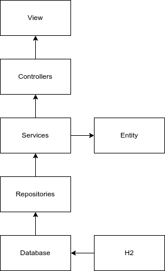

# Labo02 - Run a Spring App Locally

## Pedagogical intent
In this lab, we'll be taking the application we're going to evolve into our own hands, to discover the Spring architecture.

---

## Task 01 - Run the app

### Use Maven to package the solution

* [Maven Doc](https://maven.apache.org/guides/getting-started/maven-in-five-minutes.html#build-the-project)

Build Maven packages
```bash
mvn package
```

In case of error saying that maven is not using a lower version than the 17.
check the version that maven use with the folowing command. 
```bash
mvn -v
```

Then add in the zsh config the path of the JVM 17 version. 
```bash
nano .zshrc
export JAVA_HOME=/usr/lib/jvm/jdk-17-oracle-x64
export PATH=$JAVA_HOME/bin:$PATH
```
Close and open the terminal check the version of maven and rebuild.

* What operation does maven perform ?
```
Downloading maven packages found in the pom.xml file.
The pom.xml file is the core of a project's configuration in Maven. 
It is a single configuration file that contains the majority of information required to build a project in just the way you want.
```

Quel est le cycle de vie ? 
lis pom 
résoud les dépendance 
les télécharges / compile 
test 

target -> build


* What java dependencies are needed to make this work?

```
Java : 
webjars : is a method for managing front-end dependencies in Java applications. 
javax : transaction management, data persistence
springframework : provides a complete infrastructure for enterprise application development, with features such as inversion of control (IoC), dependency injection, transaction management, security, exception handling and more. 
jakarta : restfull web service 
```

JDK17 JVM17 


* Where do we find the pre-compiled application after that?

```
In the target folder.
```

* Delete the folder containing the pre-compiled application, try again to observe the process.

* Is it a build ready for prod ?

```
the build is faster, maybe dependencises are already installed, and it is not ready for production. 
```

### Use Java to launch the application

* [The java command](https://docs.oracle.com/en/java/javase/14/docs/specs/man/java.html)

```bash
cd target
java -jar spring-petclinic-3.2.0-SNAPSHOT.jar
```
execute le bon Java, forte contrainte avec la varriable d'environement.

* Try to access to the app via your browser

```
Then go to : http://localhost:8080/
```

how is it possible ? server se build tom4 publie l'app ? une librairie à l'interieur du build permet de faire ça. 


* You should get this page


* Stop the app

## Use the Spring Boot Maven plugin to launch the application

* [Maven plug in to run the app](https://docs.spring.io/spring-boot/docs/current/maven-plugin/reference/htmlsingle/#run)

```bash
mvn spring-boot:run
```
Quel est la différence entre java build et mvn ? 
mvnw ? run selui du projet, utilise le maven du projet et non celuis du pc 

---

## Task 02 - Explore the app

### Kind of app

* How can we access a home page via our browser?

```
Going to the folowing addres or if you are on the app click on the logo or home menu.
http://localhost:8080/
```

* Go to http://localhost:8080/owners/find and add an owner

* Using the search function, can you find it?

* Relaunch the application and try again. How is data persistence ensured?

```
Yes I can found it, no it's not persistent. 
```
Il y a une persistance de donnée avec H2, quand on arrête on pert tous. 
On vas le virer 

* How many logic layers are implemented on this application?



thymeleaf est lier à la vue mélange backend et frontend. 
Demander binj son shéma

---
## Task 03 - Docker - First Analysis

* At this stage of the analysis, can you imagine a little better what kind of needs Docker could help us with?

```
A little bit, build and publish ? 
```

* Try to list the tasks to be carried out to obtain two tiers, one hosting the application part locally and the second tier using Docker for the database engine.

```
* a container for database 
* a container for the app 
* a container for services
```
* 
